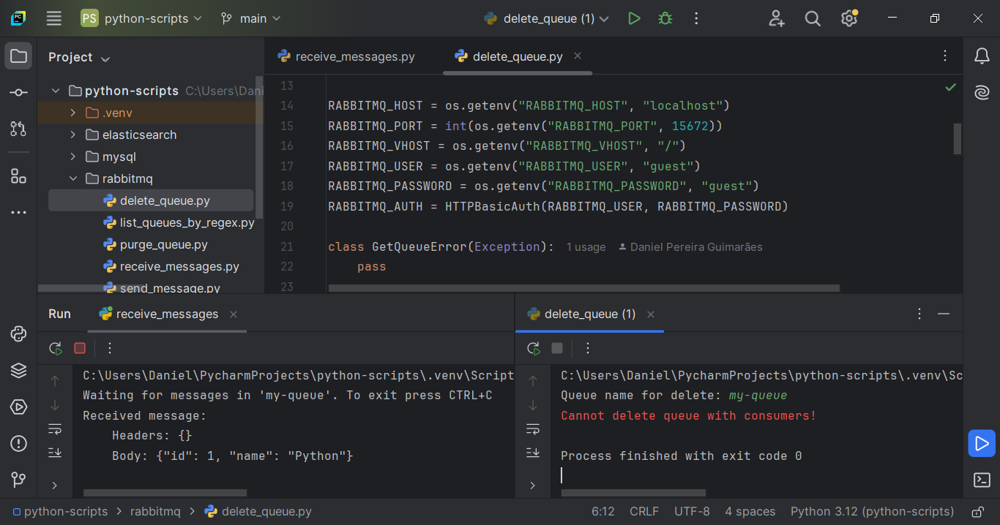

# Python Scripts

A collection of **Python** scripts for integrations with **MySQL**, **RabbitMQ**, and **Elasticsearch**. 
Each script performs specific tasks, organized by the type of integration.

## MySQL Scripts

- **csv_to_mysql.py**: Reads data from a CSV file and inserts it into a MySQL database.
- **mysql_to_csv.py**: Exports data from a MySQL database to a CSV file.
- **json_to_mysql.py**: Reads data from a JSON file and inserts it into a MySQL database.
- **mysql_to_json.py**: Exports data from a MySQL database to a JSON file.

## RabbitMQ Scripts

- **send_message.py**: Sends a message to a specified RabbitMQ queue.
- **receive_messages.py**: Receives and prints messages from a RabbitMQ queue.
- **list_queues_by_regex.py**: Lists RabbitMQ queues that match a given regular expression.
- **purge_queue.py**: Purges (deletes all messages from) a specified RabbitMQ queue.
- **delete_queue.py**: Deletes a specified RabbitMQ queue.

## Elasticsearch Scripts

- **csv_to_elasticsearch.py**: Indexes data from a CSV file into an Elasticsearch index.
- **elasticsearch_to_csv.py**: Exports data from an Elasticsearch index to a CSV file.

## License

This project is licensed under the MIT License. You are free to use, modify, and distribute the code as long as you provide proper attribution to the original author.
